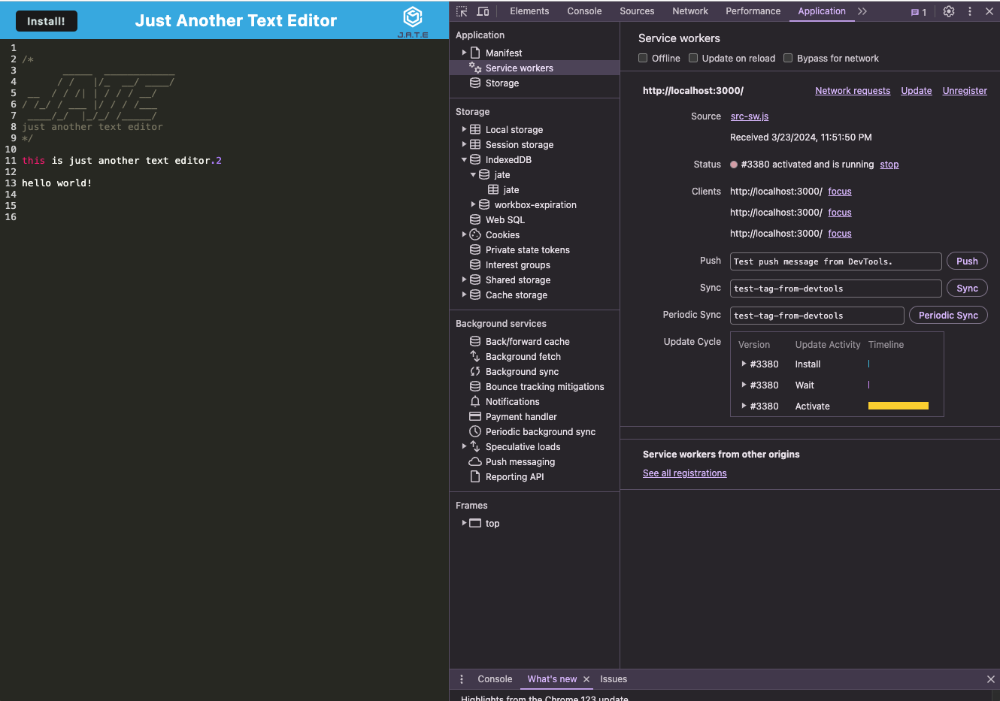

# PWAText 
## Description
- PWAText is a Progressive Web App(PWA) text editor designed to streamline your writing experience.PWAText incorporates multiple data persistence methods to ensure redundancy in the event that one option is incompatible with the browser. Additionally, the application seamlessly operates offline, providing uninterrupted functionality even without an internet connection.

## Table of Contents
- [Installation](#installation)
- [Usage](#usage)
- [Features](#features)
- [Technologies-Used](#technologies-used)
- [Contribution](#contribution)
- [dmeonstration](#demo-screenshot)

## Installation 
To install necessary dependencies, run following command:
```
npm i
```
To start the server and client development environments, run the following command:
```
npm run start:dev
```
To build the client and start the server for deployment, run the following command:
```
npm start
```
To start the server with nodemon while ignoring client files, run the following command:
```
npm run server
```
To build the client application, run the following command:
```
npm run build
```
To start the client application, run the following command:
```
npm run client
```


## Usage
1. start the application by running :
```
npm start
```
2. Writin and Ediiting :
    - Once the application loads, you'll see a text editor interface whre you can write and edit text. 
    - Simply click inside the editor area and start typing

3. Saving Content :
    - Your Content is automatically saved locally in the browser's storage

4. Offline usage :
    - The application works even when you're offline. you can continue writing and editing text without an internet connection

5. isntallation :
    - click the install button on the left top corner to install the web application as an icon on your desktop
## Features
**Progressive Web App**
* User Story
    - As a user
    - I WANT TO access my text editor from any device with a web browser,
    - SO THAT I can write and edit my content on the go without being tied to a specific device 

* Accepted Criteria 
    - Given I have accessed the web application from a modern web browser, 
    - When I open up the web application,
    - Then PWAText should load and display the text editor interface 
    - When I visit PWAText offline
    - Then I am directed to the main entry point of the web application 

**Data Persistence**
* User Story 
    - As a user with unreliable internet access, 
    - I WANT TO be able to use the web application regardless of the network conditions
    - SO THAT I can continue working even without any internet connection
    
* Accepted Criteria 
    - When a user writes content in PWAText, 
    - Then, their content is stored in the local storage and indexDb 
    - When the user visit the PWAText later without internet connection,
    - Then, they can access their previous work and edit it seamlessly

**Installation**
* User Story 
    - As a user 
    - I WANT TO be able to install the web application on my device 
    - SO THAT I can access it quickly and conventiently 
* Accepted Criteria 
    - When I click the install button on the left top corner of the web application 
    - Then I am presented with the installation prompt 
    - When I confirm the installation,
    - Then PWQText is installed on my device and I can access it from the home screen 
    - When the installation is successful, 
    - Then the install button is disabled.


## Technologies-Used
* Client-side 
    - HTML/CSS
    - JavaScript
    - CodeMirror: implementing the text editor functionality in the web application.
    - Workbox: implementing service workers and offline caching for the progressive web app (PWA).
    - Babel: transpiling modern JavaScript code (ES6+) 
    - Webpack: Module bundler used for bundling JavaScript files and assets for deployment.
    
## Contribution 
1. Fork the Repo 
2. Create a new branch 
3. Make your contributions/changes 
4. push to the forked repo 
5. create a new pull request


## Demonstration
* following is a demo of npm run build


* following is a demo of installation


* following is a schreenrecording of manifest 


* following is a schreenshot of service-worker


*following is a schreenrecording of indexDB


!
## Contact

If you have any questions or suggestions regarding this project, feel free to reach out:

- **Email:** ks02ks2000@gmail.com
- **GitHub:** lucyJihyeon(https://github.com/lucyJihyeon)

